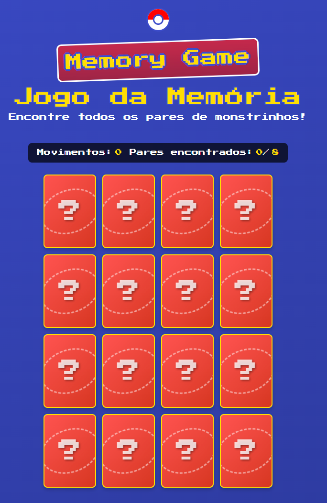

# Jogo da Memória | Memory Game

<div align="center">
  
  
  
  [🇧🇷 Português](#-português) | [🇺🇸 English](#-english)
  
  ### 🎮 [Jogar Agora | Play Now](https://michelschiavo.github.io/jogo-da-memoria/)
  
</div>

---

## 🇧🇷 Português

### 📋 Sobre o Projeto

Este projeto é um jogo da memória clássico desenvolvido com React e TypeScript, onde os jogadores precisam encontrar pares de cartas com monstrinhos. O jogo utiliza uma API pública para obter imagens de criaturas e oferece diferentes níveis de dificuldade.

### ✨ Funcionalidades

- **Três níveis de dificuldade**: Fácil (6 pares), Médio (8 pares) e Difícil (12 pares)
- **Interface responsiva**: Funciona em dispositivos móveis e desktops
- **Design temático**: Visual de jogo retrô com temática de criaturas
- **Animações fluidas**: Cartas com animações de virada usando Framer Motion
- **Feedback de desempenho**: Mensagem de finalização baseada na quantidade de movimentos
- **Contagem de movimentos e pares encontrados**: Acompanhe seu progresso durante o jogo

### 🛠️ Tecnologias Utilizadas

- **React**: Biblioteca para construção de interfaces
- **TypeScript**: Adiciona tipagem estática ao JavaScript
- **Styled Components**: Para estilização com CSS-in-JS
- **Framer Motion**: Biblioteca para animações
- **Axios**: Cliente HTTP para requisições à API
- **Vite**: Ferramenta de build rápida e moderna

### 🚀 Como Executar

1. Clone o repositório

   ```bash
   git clone https://github.com/MichelSchiavo/jogo-da-memoria.git
   cd jogo-da-memoria
   ```

2. Instale as dependências

   ```bash
   npm install
   # ou
   yarn install
   ```

3. Execute o projeto localmente

   ```bash
   npm run dev
   # ou
   yarn dev
   ```

4. Acesse o jogo em `http://localhost:5173`

### 📱 Responsividade

O jogo foi desenvolvido pensando na experiência de usuário em diferentes dispositivos:

- **Desktop**: Layout otimizado com grid de 4 colunas
- **Tablet**: Layout adaptado com grid de 3 colunas
- **Mobile**: Layout ajustado para telas menores com grid redimensionado

### 🎯 Regras do Jogo

1. Escolha um nível de dificuldade
2. Memorize a posição das cartas
3. Vire duas cartas por vez para tentar encontrar pares
4. Se as cartas forem iguais, elas permanecerão viradas
5. Se forem diferentes, elas serão viradas para baixo novamente
6. O jogo termina quando todos os pares forem encontrados
7. Tente completar com o menor número possível de movimentos!

### 🏆 Sistema de Pontuação

O jogo avalia seu desempenho com base no número de movimentos:

- **≤ 10 movimentos**: Mestre das Criaturas! 🏆
- **≤ 15 movimentos**: Ótimo potencial! 🥈
- **≤ 20 movimentos**: Bom desempenho! 🥉
- **> 20 movimentos**: Você completou o desafio! 🎮

### 🔄 Futuras Melhorias

- [ ] Adicionar sistema de pontuação com ranking
- [ ] Implementar cronômetro e modos de jogo com tempo
- [ ] Permitir personalização de temas
- [ ] Adicionar efeitos sonoros e música de fundo
- [ ] Incluir modo multijogador local

---

## 🇺🇸 English

### 📋 About the Project

This project is a classic memory game developed with React and TypeScript, where players need to find pairs of cards with little monsters. The game uses a public API to get creature images and offers different difficulty levels.

### ✨ Features

- **Three difficulty levels**: Easy (6 pairs), Medium (8 pairs), and Hard (12 pairs)
- **Responsive interface**: Works on mobile devices and desktops
- **Themed design**: Retro game look with creature theme
- **Smooth animations**: Card flip animations using Framer Motion
- **Performance feedback**: End message based on the number of moves
- **Move count and found pairs**: Track your progress during the game

### 🛠️ Technologies Used

- **React**: Library for building interfaces
- **TypeScript**: Adds static typing to JavaScript
- **Styled Components**: For CSS-in-JS styling
- **Framer Motion**: Animation library
- **Axios**: HTTP client for API requests
- **Vite**: Fast and modern build tool

### 🚀 How to Run

1. Clone the repository

   ```bash
   git clone https://github.com/MichelSchiavo/jogo-da-memoria.git
   cd jogo-da-memoria
   ```

2. Install dependencies

   ```bash
   npm install
   # or
   yarn install
   ```

3. Run the project locally

   ```bash
   npm run dev
   # or
   yarn dev
   ```

4. Access the game at `http://localhost:5173`

### 📱 Responsiveness

The game was developed with the user experience in mind for different devices:

- **Desktop**: Optimized layout with 4-column grid
- **Tablet**: Adapted layout with 3-column grid
- **Mobile**: Adjusted layout for smaller screens with resized grid

### 🎯 Game Rules

1. Choose a difficulty level
2. Memorize the position of the cards
3. Flip two cards at a time to try to find pairs
4. If the cards match, they will remain flipped
5. If they don't match, they will be flipped back down
6. The game ends when all pairs are found
7. Try to complete with the least number of moves possible!

### 🏆 Scoring System

The game evaluates your performance based on the number of moves:

- **≤ 10 moves**: Creature Master! 🏆
- **≤ 15 moves**: Great potential! 🥈
- **≤ 20 moves**: Good performance! 🥉
- **> 20 moves**: You completed the challenge! 🎮

### 🔄 Future Improvements

- [ ] Add scoring system with ranking
- [ ] Implement timer and time-based game modes
- [ ] Allow theme customization
- [ ] Add sound effects and background music
- [ ] Include local multiplayer mode

---

## 📝 License | Licença

This project is under the MIT license. See the [LICENSE](LICENSE) file for more details.

Este projeto está sob a licença MIT. Consulte o arquivo [LICENSE](LICENSE) para mais detalhes.

## 👨‍💻 Author | Autor

Michel Schiavo - [Github](https://github.com/MichelSchiavo)

---

<div align="center">
  Developed for educational and entertainment purposes.
  
  Desenvolvido para fins educacionais e de entretenimento.
</div>
